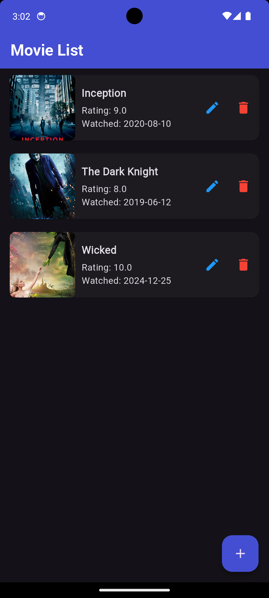
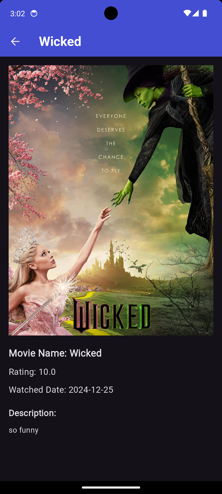

# Movie App

A Flutter application for managing a list of movies you have watched. You can add, edit, and delete movies, as well as view their details.

## Features
- Add new movies with name, rating, watched date, description, and image.
- Edit or delete existing movies.
- View movie details including an image, rating, and description.
- Display a list of movies in a scrollable view.

## Installation
1. Clone the repository:
   ```sh
   git clone https://github.com/yourusername/movie_app.git
   ```
2. Navigate to the project directory:
   ```sh
   cd movie_app
   ```
3. Install dependencies:
   ```sh
   flutter pub get
   ```
4. Run the app:
   ```sh
   flutter run
   ```

## Dependencies
This project uses the following Flutter packages:
- `flutter` (Framework)
- `cupertino_icons` (iOS-style icons for the app)

## Screenshots

### Home Screen


### Movie List


## Demo GIF


## Demo Video

<video width="500" controls>
  <source src="assets/video/demo.mp4" type="video/mp4">
  Your browser does not support the video tag.
</video>


## Getting Started with Flutter
If you're new to Flutter, here are some resources to help you get started:
- [Lab: Write your first Flutter app](https://docs.flutter.dev/get-started/codelab)
- [Cookbook: Useful Flutter samples](https://docs.flutter.dev/cookbook)
- [Flutter documentation](https://docs.flutter.dev/)

## License
This project is licensed under the MIT License. Feel free to use and modify it as needed.

---
Feel free to update this README with more details as the project progresses!

